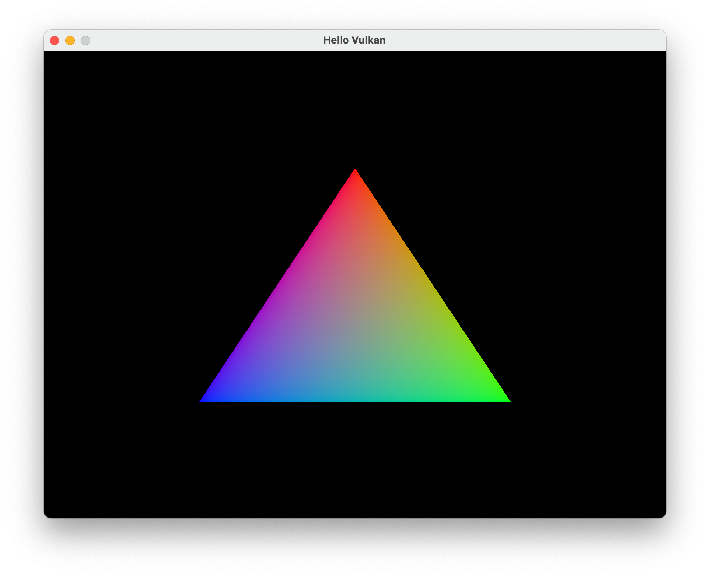
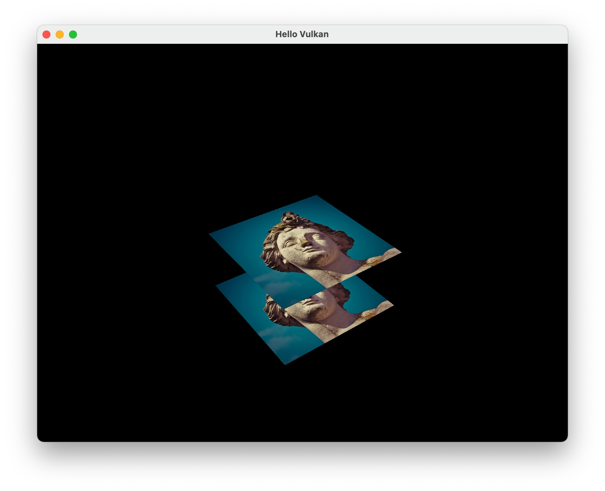
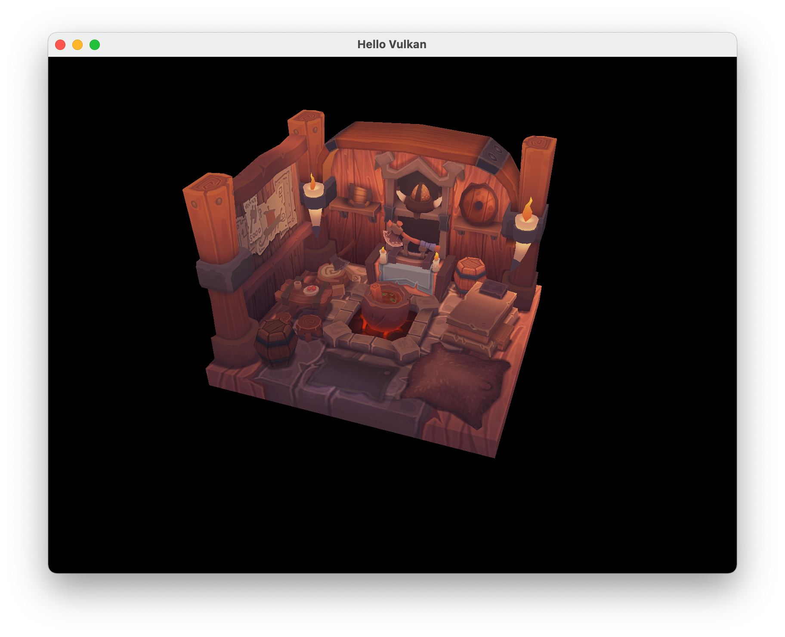
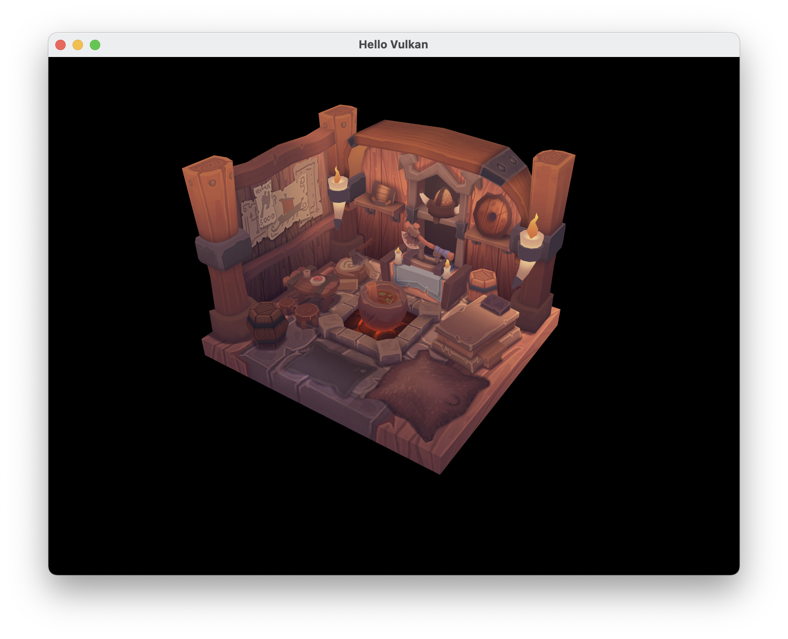

# Vulkan Tutorial

| Triangle | Depth buffer | Load a model | Multisampling |
|:--------:|:------------:|:------------:|:-------------:|
|  |  |  |  |

## Dependencies

- [Vulkan SDK](https://vulkan.lunarg.com/sdk/home)
- [GLFW](https://www.glfw.org/download.html)
- [GLM](https://github.com/g-truc/glm)

## Install, Build and Run

1. Get GLFW and GLM source code:
    ```
    git submodule update --init --recursive
    ```
    The pre-compiled GLFW for macOS platform is placed in `lib` directory. Other platforms, you need to compile GLFW by yourself.
2. Install [Vulkan SDK](https://vulkan.lunarg.com/doc/sdk/1.2.189.0/mac/getting_started.html)
3. Build:
    ```bash
    $ mkdir build && cd build
    $ cmake ..
    $ make
    ```
4. Run:
    ```bash
    $ ./test  # minimal test
    $ ./main
    ```

See [https://vulkan-tutorial.com/](https://vulkan-tutorial.com/)